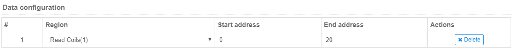
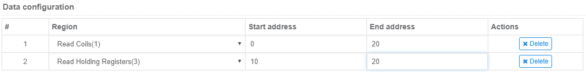

## Overview

Connect to Janus as a Modbus Master or Slave

## Data format

Read data is formatted as JSON

Seq | Key   | Required | Description
--- | ----- | :------: | -------------------------------------------------------------------------------------------
1   | token | True     | Access token obtained in the Janus settings page
2   | uuid  | True     | The UUID of the device
3   | data  | True     | Data being read

## Data read example 1

Read from region `Read Coils`, starts at address `0`, ends at address `20`, configuration as below:



Code example:

``` JSON
{
    "uuid":"Device_UUID", 
    "action":"data",
    "data":{
        "1_0":false, 
        "1_1":false, 
        "1_2":false, 
        ...
        "1_20":false
    }
}
```
## Data read example 2

Read from region `Read Coils`, starts at address `0`, ends at address `5`, and region `Read Holding Register`, starts
at address `10`, ends at address `20`, configuration as below:



Code example:

``` JSON
{
    "uuid":"Device_UUID", 
    "action":"data",
    "data":{
        "1_0":false, 
        "1_1":false, 
        "1_2":false, 
        ...
        "1_20":false,
        "3_10":"1001", 
        "3_11":"1001", 
        "3_11":"1001", 
        ...
        "3_20":"1001"
    }
}
```