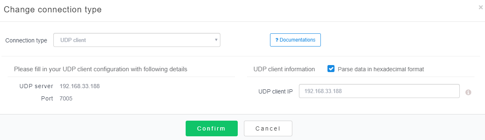

## Overview

Connects to Janus as a UDP client. There are two types of data that are accepted:

1. Raw
2. JSON

## Configuration screen shot




## 1. Raw data

A UDP client can either send decimal or hexadecimal formatted data. Janus will re-assemble the data into the following
JSON format:

``` JSON
{
	"data": "data from UDP client",
}
```

### Example

UDP client sends decimal data of value "256". Janus re-assembles the data into following JSON:

``` JSON
{
    "action":"data",
    "data":{
        "data": "256"
    }
}
```

## 2. JSON data

### Data format

Predefined fields:

Seq | Key   | Required | Description
--- | ----- | :------: | -----------------------------------------------------------------------------------------------
1   | time  | False    | Data generation date time, in `yyyyMMddHHmmssSSSS` format. Leaving it empty means use current timestamp

All other fields other than the above predefined fields will be treated as data. For example, if you're sending two
values to Janus, `speed` and `temperature`, simply add these fields into the JSON construct. See example below.

### Example

Data should be formatted as JSON

``` JSON
{
	"time": "",
	"speed": "",
	"temperature": ""
}
```
