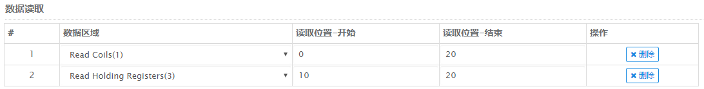

## 简述

设备根据 Modbus协议作为 master端 或 slave端 接入Janus 

## 数据格式

数据读取格式为JSON

序号|名称 | 必填 | 描述
--------- |--------- | :------: | --------------------------------
1|uuid     | 是 | 设备的序列号
2|action   | 是 | Janus 默认栏位，值为data时标识本次的操作为数据读取
3|data     | 是 | 读取的数据

## 数据读取示例一

读取数据区域[Read Coils]中0~20的数据

配置如下：


读取代码如下：

``` JSON
{
    "uuid":"设备UUID", 
    "action":"data",
    "data":{
        "1_0":false, 
        "1_1":false, 
        "1_2":false, 
        ...
        "1_20":false
    }
}
```
## 数据读取示例二

读取数据区域[Read Coils]中0~5的数据，以及数据区域[Read Holding Register]中10~20的数据

配置如下：



读取代码如下：

``` JSON
{
    "uuid":"设备UUID", 
    "action":"data",
    "data":{
        "1_0":false, 
        "1_1":false, 
        "1_2":false, 
        ...
        "1_20":false,
        "3_10":"1001", 
        "3_11":"1001", 
        "3_11":"1001", 
        ...
        "3_20":"1001"
    }
}
```