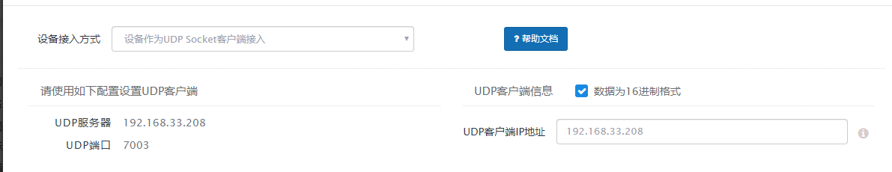

## 简述

设备作为UDP Socket客户端接入Janus，接入数据格式有两种

1.原始数据

2.JSON数据

## 配置截图




## 1. 原始数据接入

UDP Socket客户端可发送10进制/16进制数据，到达Janus后，Janus自动组装格式为:

``` JSON
{
	"data": "UDP Socket客户端发来的数据",
}
```

### 示例

UDP Socket 客户端发送10进制数据 : "256"

到达Janus后，数据格式为:

``` JSON
{
    "action":"data",
    "data":{
        "data": "256"
    }
}
```


## 2. JSON数据格式

### 传输数据参数

序号|名称 | 必填 | 描述
--------- |--------- | :------: | -------------------------------------------------------------
1|time      |  | 数据产生的时间,格式为yyyyMMddHHmmssSSS, 如该栏位为空,则取当前时间
2|speed     |  | (设备数据) speed 速度
3|temperature | | (设备数据) temperature 温度

备注：speed、temperature只是示例，在实际请求中按需（数量不限）添加自己的设备数据

### 示例

传输数据格式为JSON

``` JSON
{
	"time": "",
	"speed": "",
	"temperature": ""
}
```
